# Architecture Diagrams

Visual representation of the RAG POC system architecture using Mermaid diagrams.

## Viewing Options

### Mermaid Rendering Support

The diagrams in this document use Mermaid syntax, which is natively supported by:

- ✅ **GitHub** - Renders automatically in README and markdown files
- ✅ **VS Code** - With Mermaid extensions (Mermaid Preview, Markdown Preview Mermaid Support)
- ✅ **GitLab** - Native support
- ✅ **Azure DevOps** - With extensions
- ✅ **Notion, Confluence** - Via plugins

### Generating Static Images

If you need static PNG/SVG images instead:

#### Option 1: VS Code (Recommended)
1. Install **Mermaid Preview** extension
2. Right-click on any diagram → **Mermaid: Preview Diagram**
3. Click **Export** → Choose PNG or SVG

#### Option 2: Mermaid Live Editor
1. Visit https://mermaid.live/
2. Copy diagram code from this file
3. Click **Export** → Choose format (PNG, SVG, PDF)

#### Option 3: Command Line (mermaid-cli)
```bash
npm install -g @mermaid-js/mermaid-cli
mmdc -i ARCHITECTURE-DIAGRAMS.md -o diagrams/
```

#### Option 4: Automated in CI/CD
```yaml
# GitHub Actions example
- uses: neenjaw/compile-mermaid-markdown-action@master
  with:
    files: 'ARCHITECTURE-DIAGRAMS.md'
    output: 'docs/images'
```

## Table of Contents

1. [System Architecture](#system-architecture)
2. [Authentication Flow](#authentication-flow)
3. [RAG Query Flow](#rag-query-flow)
4. [Agent Workflow](#agent-workflow)
5. [Multi-Tenant Data Flow](#multi-tenant-data-flow)
6. [Component Dependencies](#component-dependencies)
7. [Document Ingestion Pipeline](#document-ingestion-pipeline)
8. [Deployment Architecture](#deployment-architecture)

---

## System Architecture

High-level view of all system components and their interactions.

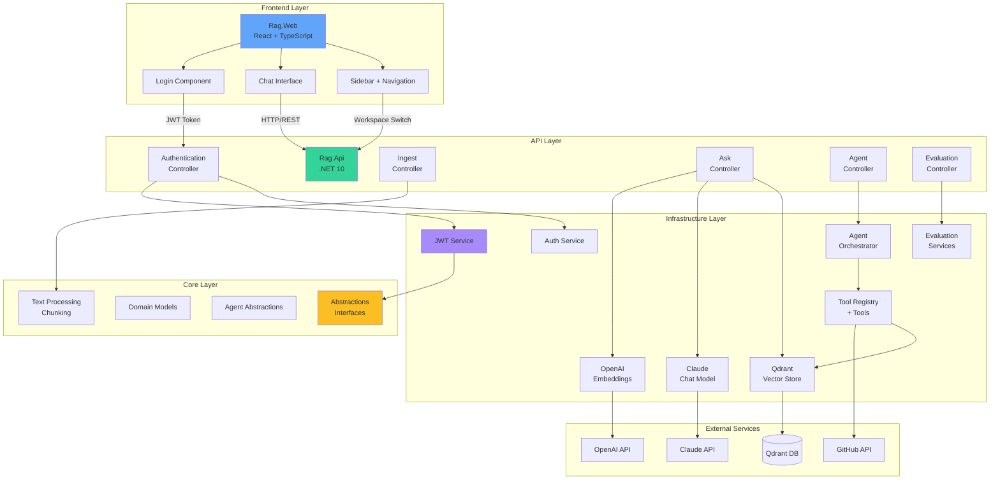

---

## Authentication Flow

JWT-based password authentication with multi-tenant user mapping.

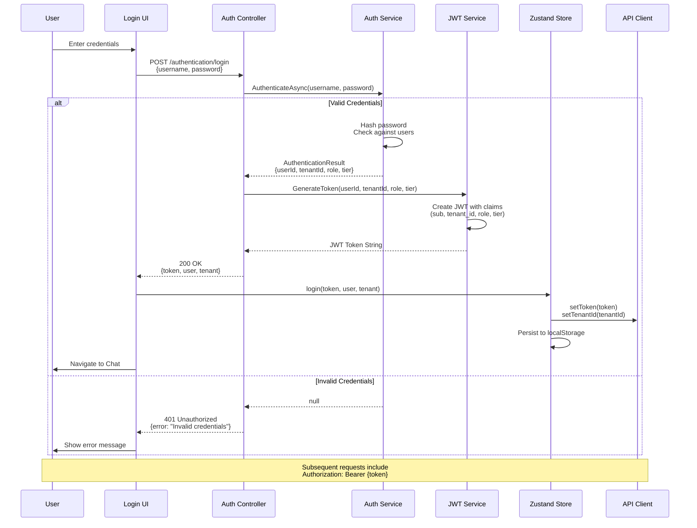

---

## RAG Query Flow

Document retrieval and answer generation pipeline.

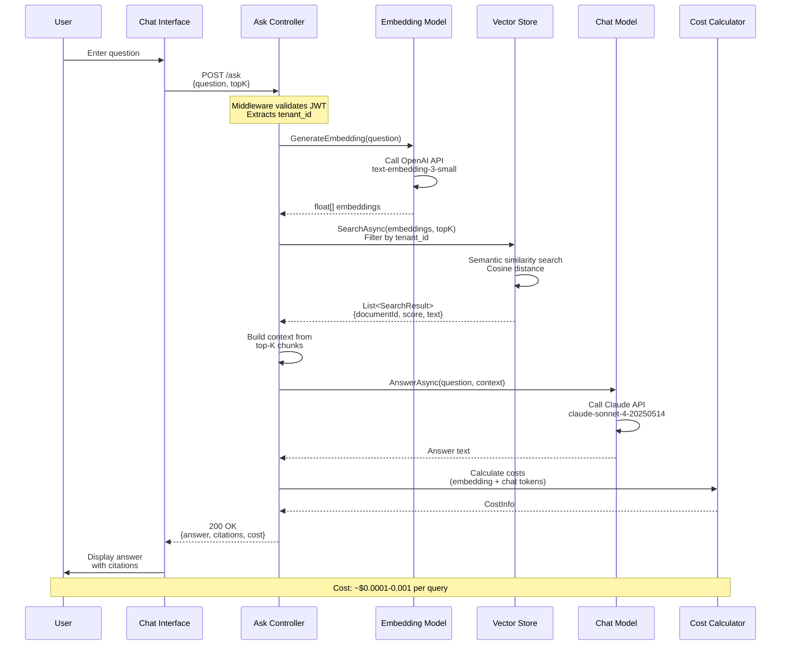

---

## Agent Workflow

Multi-step agent reasoning with tool calling capabilities.

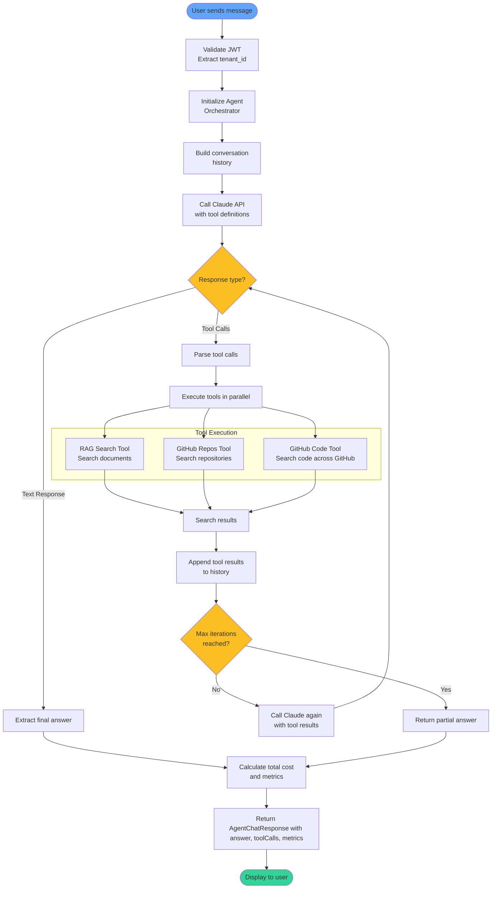

---

## Multi-Tenant Data Flow

Tenant isolation and data segregation.

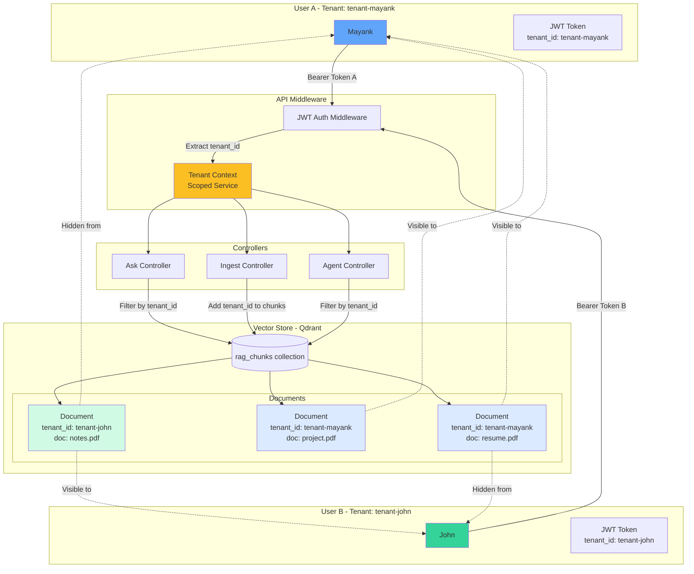

---

## Component Dependencies

.NET project dependencies and layers.

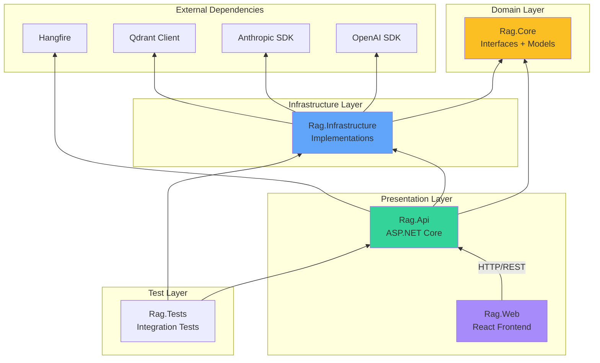

---

## Document Ingestion Pipeline

Background job processing for PDF and text ingestion.

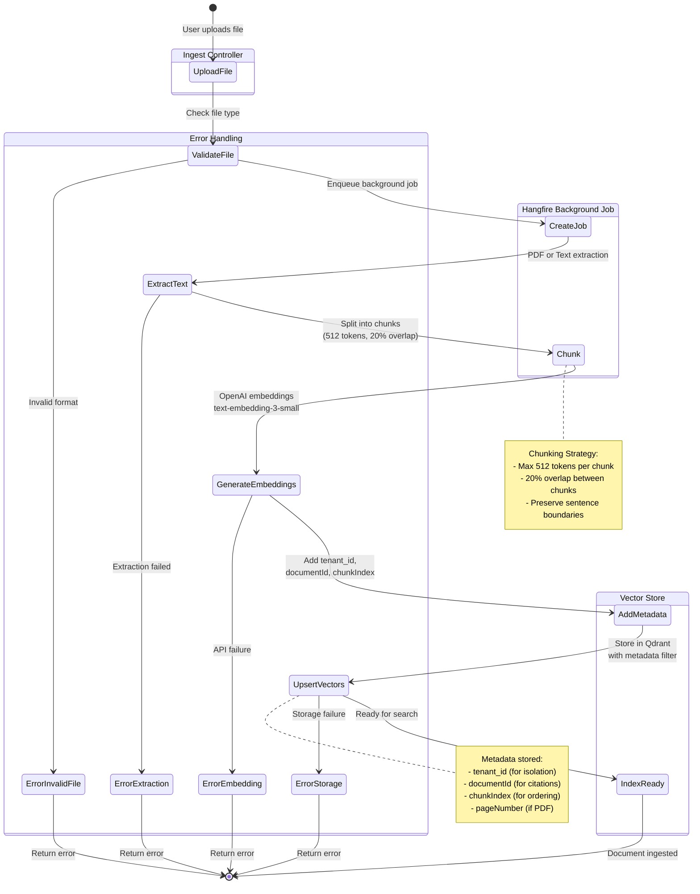

---

## Deployment Architecture

Production deployment components and infrastructure.

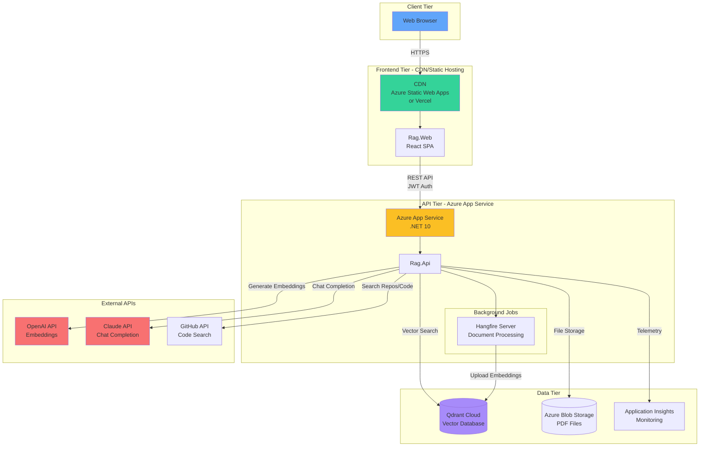

**Deployment Notes:**

- **Scalability**: Frontend on Edge CDN, API with horizontal scaling, Qdrant managed cloud, Background workers for jobs
- **Security**: JWT tokens (8h expiry), HTTPS only, Tenant isolation, API key rotation
- **Monitoring**: Application Insights, Cost tracking per query, Error logging, Performance metrics

---

## Technology Stack Summary

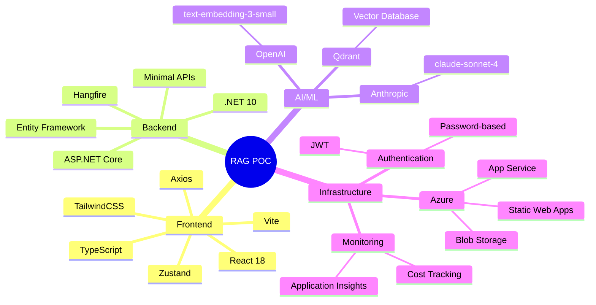

---

## Data Models

Entity relationships and data structures.

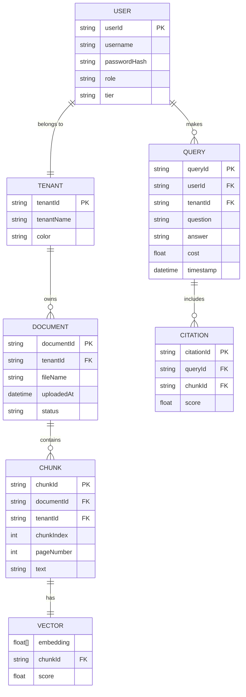

---

## Performance Metrics

Key performance indicators and optimization targets.

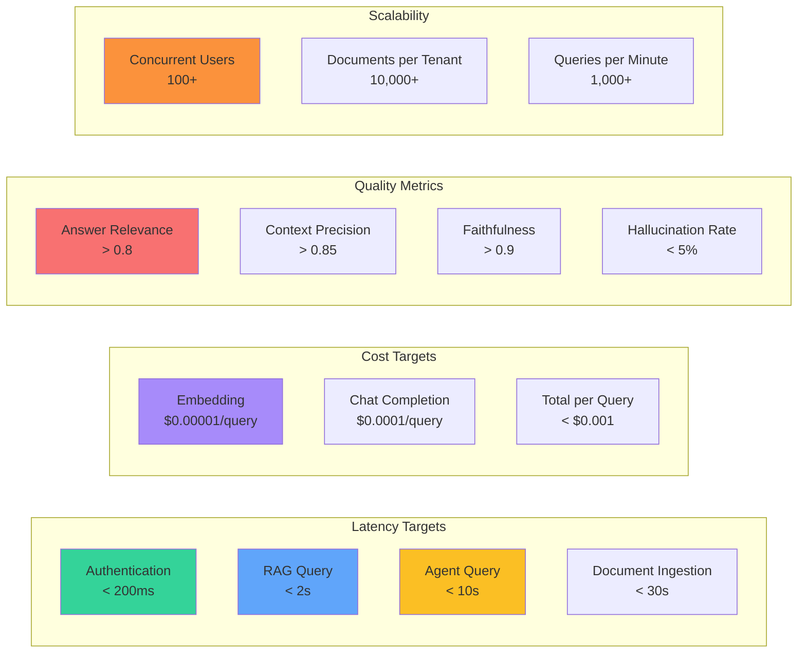

---

## Quick Reference

| Diagram | Purpose | Best For |
|---------|---------|----------|
| System Architecture | Overall system design | Understanding component relationships |
| Authentication Flow | Login process | Security implementation |
| RAG Query Flow | Document retrieval | RAG pipeline understanding |
| Agent Workflow | Multi-step reasoning | Agent behavior comprehension |
| Multi-Tenant Data Flow | Data isolation | Security & privacy verification |
| Component Dependencies | Project structure | Development & testing |
| Document Ingestion | Background processing | Data pipeline understanding |
| Deployment Architecture | Production setup | DevOps & deployment |

---

**Generated**: February 13, 2026  
**Version**: 1.0  
**Project**: RAG POC - Multi-Tenant AI Agent Platform
