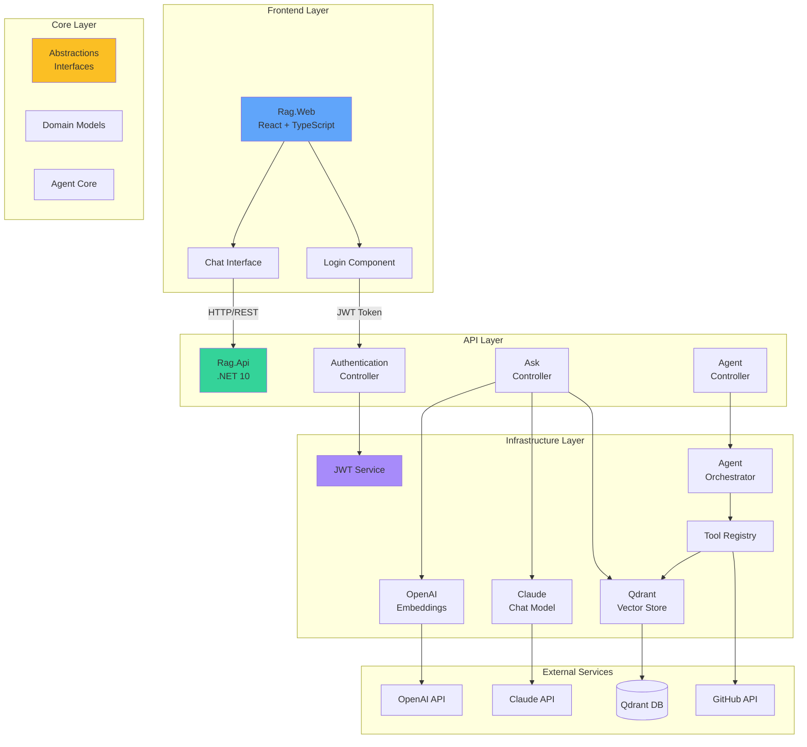
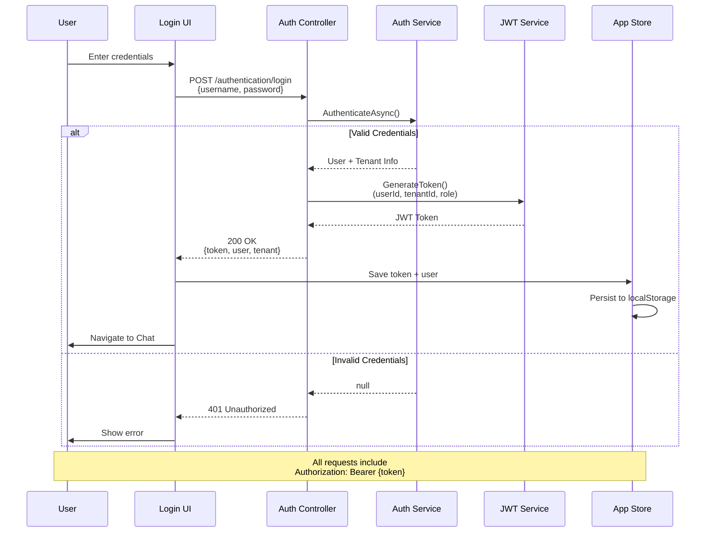
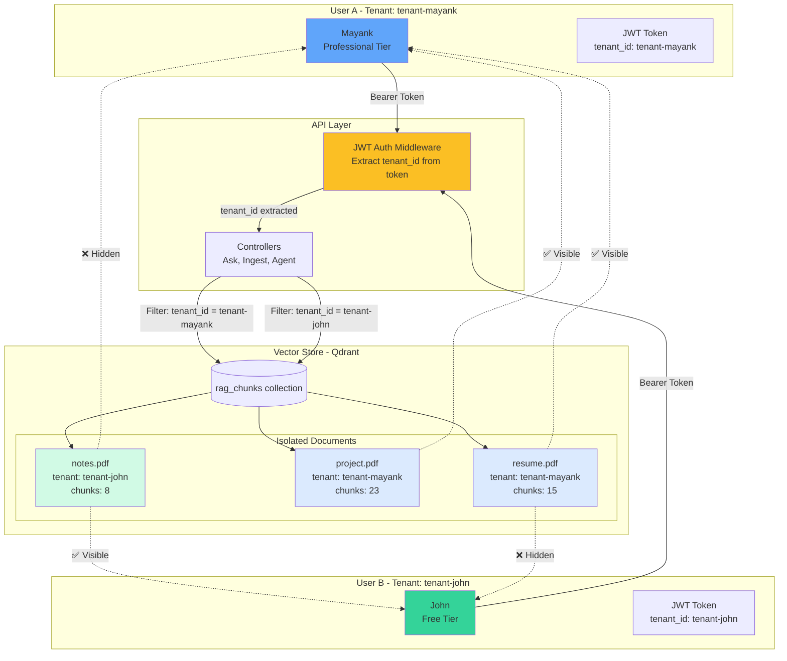
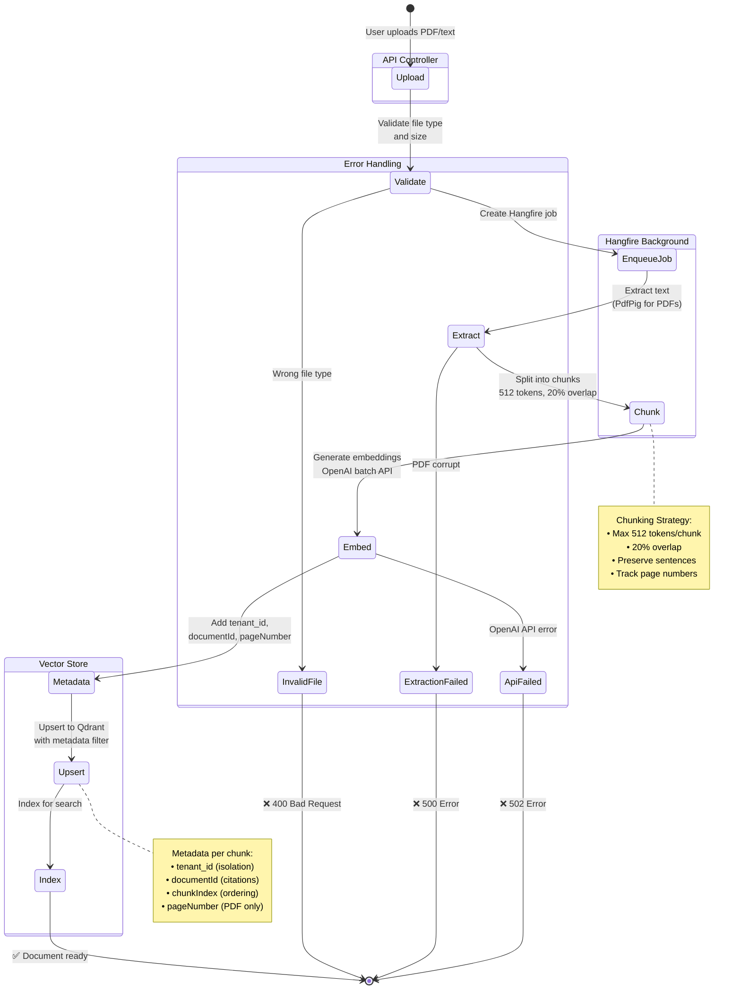

# RAG POC - Production-Grade RAG System with AI Agent

A comprehensive, production-ready Retrieval-Augmented Generation (RAG) system built with .NET 10, featuring enterprise capabilities, quality tracking, and autonomous AI agent functionality.

## 🌟 Overview

This is **not just a RAG system** - it's a complete AI platform with:
- ✅ Enterprise-grade RAG with multi-tenancy and security
- ✅ PDF processing and background job management
- ✅ RAG quality evaluation and hallucination detection
- ✅ **Autonomous AI agent with tool-calling capabilities**
- ✅ Codebase ingestion and AI-powered code understanding
- ✅ GitHub integration for research and code search
**What makes this special**: 99% of RAG implementations are basic Q&A systems. This is a **production-grade AI agent platform** with enterprise features, quality tracking, and extensible tool architecture.

## 🏗️ Architecture

```
┌─────────────────────────────────────────────────────────────────┐
│                     Rag.Web (React + TypeScript)                │
│         ChatGPT-like UI │ Multi-Tenant │ JWT Auth              │
└─────────────────────────────────────────────────────────────────┘
                              ↓ HTTP/REST
┌─────────────────────────────────────────────────────────────────┐
│                          RAG API Layer                          │
│  ┌──────────────┐  ┌──────────────┐  ┌──────────────────────┐ │
│  │   Ingest     │  │     Ask      │  │   Agent Chat         │ │
│  │ Documents    │  │  Questions   │  │  (Tool Calling)      │ │
│  └──────────────┘  └──────────────┘  └──────────────────────┘ │
│  ┌──────────────┐  ┌──────────────┐  ┌──────────────────────┐ │
│  │  Evaluation  │  │  Documents   │  │   Codebase           │ │
│  │   Testing    │  │  Management  │  │   Ingestion          │ │
│  └──────────────┘  └──────────────┘  └──────────────────────┘ │
└─────────────────────────────────────────────────────────────────┘
                              ↓
┌─────────────────────────────────────────────────────────────────┐
│                      Core RAG Engine                            │
│  ┌─────────────┐  ┌──────────────┐  ┌────────────────────────┐│
│  │  Embedding  │  │    Vector    │  │    Chat Model          ││
│  │   Model     │  │    Store     │  │   (Claude Sonnet)      ││
│  │  (OpenAI)   │  │  (Qdrant)    │  │                        ││
│  └─────────────┘  └──────────────┘  └────────────────────────┘│
└─────────────────────────────────────────────────────────────────┘
                              ↓
┌─────────────────────────────────────────────────────────────────┐
│                      Agent Layer (Phase 5)                      │
│  ┌─────────────┐  ┌──────────────┐  ┌────────────────────────┐│
│  │    Tool     │  │     Tool     │  │      Agent             ││
│  │  Registry   │  │   Executor   │  │   Orchestrator         ││
│  └─────────────┘  └──────────────┘  └────────────────────────┘│
│                                                                 │
│  Built-in Tools:                                               │
│  • rag_search - Semantic document search                       │
│  • github_search_repositories - GitHub repo search             │
│  • github_search_code - GitHub code search                     │
└─────────────────────────────────────────────────────────────────┘
                              ↓
┌─────────────────────────────────────────────────────────────────┐
│                   External Services                             │
│  ┌─────────────┐  ┌──────────────┐  ┌────────────────────────┐│
│  │   OpenAI    │  │    Qdrant    │  │   Anthropic Claude     ││
│  │  Embeddings │  │    Vector    │  │    Chat Model          ││
│  │             │  │   Database   │  │                        ││
│  └─────────────┘  └──────────────┘  └────────────────────────┘│
└─────────────────────────────────────────────────────────────────┘
```

## � Visual Architecture Diagrams

> **Note:** Diagrams are rendered automatically on GitHub using Mermaid. For local viewing, install a Mermaid preview extension in VS Code.

### 1. System Component Overview

This diagram shows how all components interact in the system, from the React frontend to external services.

<summary>📝 View Mermaid Source</summary>


---

### 2. Authentication Flow

Multi-tenant JWT authentication with password-based login. Users are mapped to tenants, and all subsequent requests include the JWT token for authorization.


<summary>📝 View Mermaid Source</summary>



**Key Points:**
- Password-based authentication with SHA256 hashing
- JWT tokens include user ID, tenant ID, role, and tier
- 8-hour token expiry
- Tokens stored in localStorage for persistence
- Demo accounts available: admin@company.com, mayank@company.com, john@company.com, sarah@company.com

---

### 3. RAG Query Flow

The complete pipeline from question to answer with citations. Shows semantic search, context building, and LLM response generation.


<summary>📝 View Mermaid Source</summary>


**Key Points:**
- Uses OpenAI's text-embedding-3-small (1536 dimensions) for semantic search
- Qdrant vector store with cosine similarity
- Top-K retrieval (default: 3 chunks)
- Context building with chunk metadata
- Claude Sonnet 4 for answer generation with citations
- Cost tracking: embedding ($0.00001) + chat ($0.0001)
- Tenant isolation via metadata filtering

---

### 4. Multi-Tenant Data Isolation

Shows how tenant data is isolated in the vector store. Each user's JWT token contains their tenant ID, which filters all queries and ingestion operations.


<summary>📝 View Mermaid Source</summary>




**Key Points:**
- Each JWT token contains a `tenant_id` claim
- All vector chunks are tagged with `tenant_id` metadata
- Queries automatically filter by tenant ID (users cannot access other tenants' data)
- Document ingestion adds tenant ID to all chunks
- No database-level tenancy - isolation via metadata filtering
- Different tiers: Enterprise, Professional, Free (rate limits, features vary)

---

### 5. Agent Workflow with Tool Calling

The agent can reason through multi-step problems using available tools (RAG search, GitHub repos, GitHub code search).


<summary>📝 View Mermaid Source</summary>


**Key Points:**
- Agent uses Claude's native tool calling (Anthropic format)
- Max 5 iterations to prevent infinite loops
- Tools executed in parallel when possible
- Chain-of-thought reasoning preserved in conversation history
- Each tool call tracked with input/output for debugging
- Cost tracked across all Claude API calls
- Typical flow: 2-3 iterations, 2-5 seconds total

---

### 6. Document Ingestion Pipeline

Background job processing for PDF and text document ingestion using Hangfire.


<summary>📝 View Mermaid Source</summary>




**Key Points:**
- Asynchronous processing with Hangfire (job queue)
- PDF text extraction with PdfPig library
- Smart chunking: 512 tokens max, 20% overlap
- Page number tracking for PDF citations
- Batch embedding generation (cost optimization)
- Hangfire dashboard at `/hangfire` for monitoring
- Job retry on transient failures (3 attempts)
- Status tracking: Pending → Processing → Completed/Failed

---

### 📸 How to Generate Diagram Images

To generate PNG images from these Mermaid diagrams:

**Option 1: VS Code (Recommended)**
1. Install [Mermaid Preview](https://marketplace.visualstudio.com/items?itemName=vstirbu.vscode-mermaid-preview) extension
2. Open this README, right-click on any diagram → **Mermaid: Preview Diagram**
3. Click **Export** → Save as PNG to `diagrams/` folder

**Option 2: Online Editor**
1. Visit [mermaid.live](https://mermaid.live/)
2. Copy any diagram code from the collapsed sections above
3. Export as PNG and save to `diagrams/` folder with the appropriate filename

**Option 3: CLI Tool**
```bash
npm install -g @mermaid-js/mermaid-cli
mmdc -i ARCHITECTURE-DIAGRAMS.md -o diagrams/
```

**📝 Note:** For more detailed diagrams including deployment architecture, performance metrics, and data models, see [ARCHITECTURE-DIAGRAMS.md](ARCHITECTURE-DIAGRAMS.md).

## �📋 Complete Feature List

### Phase 1: Hardening & Performance
- ✅ Resilient HTTP clients with Polly (retry, circuit breaker)
- ✅ Rate limiting (fixed window, sliding window, token bucket)
- ✅ Structured error handling
- ✅ Embedding caching for performance
- ✅ Graceful degradation

### Phase 2: Enterprise Features
- ✅ Multi-tenancy with data isolation
- ✅ Tenant context middleware
- ✅ Per-tenant vector storage

### Phase 3A: Security
- ✅ API key authentication
- ✅ JWT authentication
- ✅ User context tracking
- ✅ Secure configuration management

### Phase 3B: Real-World Features
- ✅ PDF text extraction with pagination tracking
- ✅ Background job processing (Hangfire)
- ✅ Document update/delete operations
- ✅ Hangfire dashboard for job monitoring
- ✅ Cost tracking and estimation

### Phase 4: Evaluation & Quality
- ✅ Test case management (CRUD)
- ✅ Semantic similarity evaluation
- ✅ Keyword matching evaluation
- ✅ Citation accuracy tracking
- ✅ Hallucination detection (LLM-as-judge)
- ✅ Evaluation run history
- ✅ Aggregate metrics and reporting

### Phase 5: Agent Layer (🚀 Advanced)
- ✅ MCP-like tool abstraction
- ✅ Tool registry and executor
- ✅ Intelligent agent orchestration
- ✅ Multi-step reasoning
- ✅ Parallel and sequential tool execution
- ✅ Codebase ingestion and indexing
- ✅ GitHub integration (repos and code search)
- ✅ Chain-of-thought reasoning
- ✅ Conversation history tracking

## 🔌 Complete API Reference

Base URL: `http://localhost:5129`

### 1. Ingestion Endpoints

#### Ingest Text Document
```http
POST /ingest
Content-Type: application/json
X-API-Key: secure_password
X-Tenant-Id: your-tenant-id

{
  "documentId": "doc-001",
  "text": "Your document content..."
}

Response: 200 OK
{
  "message": "Document ingested successfully",
  "documentId": "doc-001",
  "chunksCreated": 5
}
```

#### Upload PDF Document
```http
POST /documents/upload-pdf
X-API-Key: secure_password
X-Tenant-Id: your-tenant-id
Content-Type: multipart/form-data

file: [PDF file]
documentId: "pdf-doc-001"

Response: 202 Accepted
{
  "message": "PDF upload started",
  "jobId": "hangfire-job-123",
  "documentId": "pdf-doc-001"
}
```

### 2. Query Endpoints

#### Ask Question (RAG Query)
```http
POST /ask
Content-Type: application/json
X-API-Key: secure_password
X-Tenant-Id: your-tenant-id

{
  "question": "What is Qdrant?",
  "topK": 3
}

Response: 200 OK
{
  "answer": "Qdrant is a vector database...",
  "citations": [...],
  "cost": {
    "embeddingCost": 0.0001,
    "chatCost": 0.003,
    "totalCost": 0.0031
  }
}
```

### 3. Evaluation Endpoints

See [PHASE4-EVALUATION-QUALITY.md](PHASE4-EVALUATION-QUALITY.md) for complete API reference.

Key endpoints:
- `POST /evaluation/test-cases` - Create test case
- `GET /evaluation/test-cases` - List test cases
- `POST /evaluation/run` - Run evaluation
- `GET /evaluation/runs/{runId}` - Get results
- `GET /evaluation/metrics` - Aggregate metrics

### 4. Agent Endpoints (🚀 Advanced)

See [PHASE5-AGENT-LAYER.md](PHASE5-AGENT-LAYER.md) for complete API reference.

#### Chat with Agent
```http
POST /agent/chat
Content-Type: application/json
X-API-Key: secure_password

{
  "message": "Research vector databases",
  "config": {
    "maxToolCalls": 5,
    "allowParallelToolCalls": true,
    "enableChainOfThought": true
  }
}

Response: 200 OK
{
  "answer": "Based on research...",
  "toolCalls": [...],
  "metrics": {
    "toolCallsCount": 2,
    "durationMs": 2450,
    "estimatedCost": 0.0045
  }
}
```

Other agent endpoints:
- `GET /agent/tools` - List available tools
- `POST /agent/ingest-codebase` - Ingest codebase
- `POST /agent/search-code` - Semantic code search
- `GET /agent/code-context` - Get file context

## 🎨 Frontend Integration Guide

This API is designed to be consumed by any frontend framework. See complete frontend guide in the documentation above.

### Quick Start for Frontend Developers

1. **Install your preferred framework**: React, Vue, Angular, Blazor
2. **Base API URL**: `http://localhost:5129`
3. **Authentication**: Include `X-API-Key: secure_password` header
4. **Multi-tenancy**: Include `X-Tenant-Id` header (optional)

### Key Frontend Features to Build

1. **Document Management**
   - Upload PDFs/text
   - List documents
   - Delete documents

2. **RAG Q&A Interface**
   - Chat interface
   - Display citations
   - Show relevance scores

3. **Agent Playground**
   - Chat with AI agent
   - View tool calls in real-time
   - Display reasoning traces

4. **Evaluation Dashboard**
   - Create test cases
   - Run evaluations
   - Visualize metrics

5. **Code Explorer**
   - Ingest codebases
   - Search code semantically
   - View code snippets

## 🚀 Getting Started

### Prerequisites
- .NET 10 SDK
- Qdrant (Docker: `docker run -p 6333:6333 qdrant/qdrant`)
- OpenAI API key
- Anthropic API key (Claude)

### Configuration

Update `appsettings.json`:
```json
{
  "Qdrant": {
    "Endpoint": "http://localhost:6333"
  },
  "OpenAI": {
    "ApiKey": "your-openai-api-key",
    "EmbeddingModel": "text-embedding-3-small"
  },
  "Anthropic": {
    "ApiKey": "your-anthropic-api-key",
    "Model": "claude-sonnet-4-20250514"
  },
  "Security": {
    "ApiKey": "secure_password"
  }
}
```

### Run the API

```bash
# Restore dependencies
dotnet restore

# Build
dotnet build

# Run
dotnet run --project src/Rag.Api

# API available at: http://localhost:5129
# Hangfire dashboard: http://localhost:5129/hangfire
```

### Test with Examples

Use `tests.http` file (38 requests covering all endpoints):
- Requests 1-12: Basic RAG operations
- Requests 13-25: Evaluation endpoints
- Requests 26-38: Agent endpoints

## 📊 Technology Stack

- **Framework**: .NET 10
- **Vector Database**: Qdrant
- **Embedding Model**: OpenAI text-embedding-3-small
- **Chat Model**: Anthropic Claude Sonnet 4
- **Background Jobs**: Hangfire
- **PDF Processing**: PdfPig
- **Resilience**: Polly
- **Authentication**: JWT + API Keys

## 📖 Documentation

- [TESTING-GUIDE.md](TESTING-GUIDE.md) - Integration testing
- [PHASE4-EVALUATION-QUALITY.md](PHASE4-EVALUATION-QUALITY.md) - Evaluation system
- [PHASE5-AGENT-LAYER.md](PHASE5-AGENT-LAYER.md) - Agent architecture
- [tests.http](tests.http) - 38 API examples

## 🎯 Key Differentiators

### Why This Stands Out

1. **Not Just RAG** - Full AI agent with tool-calling
2. **Production-Grade** - Multi-tenancy, auth, rate limiting
3. **Quality-First** - Built-in evaluation and hallucination detection
4. **Extensible** - MCP-like tool architecture
5. **Enterprise-Ready** - Background jobs, PDF support, cost tracking
6. **Well-Documented** - Comprehensive docs and examples

### Comparison Table

| Feature | Typical RAG | This System |
|---------|-------------|-------------|
| Document Q&A | ✅ | ✅ |
| Multi-tenancy | ❌ | ✅ |
| Authentication | ❌ | ✅ |
| PDF Support | ❌ | ✅ |
| Quality Evaluation | ❌ | ✅ |
| Hallucination Detection | ❌ | ✅ |
| Tool-Calling | ❌ | ✅ |
| Agent Orchestration | ❌ | ✅ |
| Codebase Understanding | ❌ | ✅ |
| GitHub Integration | ❌ | ✅ |

## 🔮 Future Enhancements

- Streaming responses (SSE/WebSocket)
- Advanced caching (Redis, semantic cache)
- More tools (web scraping, SQL, calculator)
- Long-term memory
- OpenTelemetry observability
- Hybrid search (vector + keyword)
- Database migration (SQL Server/PostgreSQL)

## 📝 Stats

- **Total LOC**: ~6,000+ lines
- **Total Files**: 50+ files
- **Phases Completed**: 5/5
- **API Endpoints**: 38+ endpoints
- **Built-in Tools**: 3 tools
- **Status**: Production-Ready 🚀

---

**Built with ❤️ to showcase production-grade RAG + AI Agent architecture**