# RAG POC - Production-Grade RAG System with AI Agent

A comprehensive, production-ready Retrieval-Augmented Generation (RAG) system built with .NET 10, featuring enterprise capabilities, quality tracking, and autonomous AI agent functionality.

## 🌟 Overview

This is **not just a RAG system** - it's a complete AI platform with:
- ✅ **Modern React frontend** with ChatGPT-like UI
- ✅ Enterprise-grade RAG with multi-tenancy and security
- ✅ PDF processing and background job management
- ✅ RAG quality evaluation and hallucination detection
- ✅ **Autonomous AI agent with tool-calling capabilities**
- ✅ Codebase ingestion and AI-powered code understanding
- ✅ GitHub integration for research and code search

**What makes this special**: 99% of RAG implementations are basic Q&A systems. This is a **production-grade AI agent platform** with enterprise features, quality tracking, extensible tool architecture, and a **polished user interface** ready for end users.

## 🏗️ Architecture

```
┌─────────────────────────────────────────────────────────────────┐
│                     Rag.Web (React + TypeScript)                │
│         ChatGPT-like UI │ Multi-Tenant │ JWT Auth              │
└─────────────────────────────────────────────────────────────────┘
                              ↓ HTTP/REST
┌─────────────────────────────────────────────────────────────────┐
│                          RAG API Layer                          │
│  ┌──────────────┐  ┌──────────────┐  ┌──────────────────────┐ │
│  │   Ingest     │  │     Ask      │  │   Agent Chat         │ │
│  │ Documents    │  │  Questions   │  │  (Tool Calling)      │ │
│  └──────────────┘  └──────────────┘  └──────────────────────┘ │
│  ┌──────────────┐  ┌──────────────┐  ┌──────────────────────┐ │
│  │  Evaluation  │  │  Documents   │  │   Codebase           │ │
│  │   Testing    │  │  Management  │  │   Ingestion          │ │
│  └──────────────┘  └──────────────┘  └──────────────────────┘ │
└─────────────────────────────────────────────────────────────────┘
                              ↓
┌─────────────────────────────────────────────────────────────────┐
│                      Core RAG Engine                            │
│  ┌─────────────┐  ┌──────────────┐  ┌────────────────────────┐│
│  │  Embedding  │  │    Vector    │  │    Chat Model          ││
│  │   Model     │  │    Store     │  │   (Claude Sonnet)      ││
│  │  (OpenAI)   │  │  (Qdrant)    │  │                        ││
│  └─────────────┘  └──────────────┘  └────────────────────────┘│
└─────────────────────────────────────────────────────────────────┘
                              ↓
┌─────────────────────────────────────────────────────────────────┐
│                      Agent Layer (Phase 5)                      │
│  ┌─────────────┐  ┌──────────────┐  ┌────────────────────────┐│
│  │    Tool     │  │     Tool     │  │      Agent             ││
│  │  Registry   │  │   Executor   │  │   Orchestrator         ││
│  └─────────────┘  └──────────────┘  └────────────────────────┘│
│                                                                 │
│  Built-in Tools:                                               │
│  • rag_search - Semantic document search                       │
│  • github_search_repositories - GitHub repo search             │
│  • github_search_code - GitHub code search                     │
└─────────────────────────────────────────────────────────────────┘
                              ↓
┌─────────────────────────────────────────────────────────────────┐
│                   External Services                             │
│  ┌─────────────┐  ┌──────────────┐  ┌────────────────────────┐│
│  │   OpenAI    │  │    Qdrant    │  │   Anthropic Claude     ││
│  │  Embeddings │  │    Vector    │  │    Chat Model          ││
│  │             │  │   Database   │  │                        ││
│  └─────────────┘  └──────────────┘  └────────────────────────┘│
└─────────────────────────────────────────────────────────────────┘
```

## � Visual Architecture Diagrams

> **Note:** Diagrams are rendered automatically on GitHub using Mermaid. For local viewing, install a Mermaid preview extension in VS Code.

### 1. System Component Overview

This diagram shows how all components interact in the system, from the React frontend to external services.

<summary>📝 View Mermaid Source</summary>


---

### 2. Authentication Flow

Multi-tenant JWT authentication with password-based login. Users are mapped to tenants, and all subsequent requests include the JWT token for authorization.

<summary>📝 View Mermaid Source</summary>


**Key Points:**
- Password-based authentication with SHA256 hashing
- JWT tokens include user ID, tenant ID, role, and tier
- 8-hour token expiry
- Tokens stored in localStorage for persistence
- Demo accounts available: admin@company.com, mayank@company.com, john@company.com, sarah@company.com

---

### 3. RAG Query Flow

The complete pipeline from question to answer with citations. Shows semantic search, context building, and LLM response generation.


<summary>📝 View Mermaid Source</summary>


**Key Points:**
- Uses OpenAI's text-embedding-3-small (1536 dimensions) for semantic search
- Qdrant vector store with cosine similarity
- Top-K retrieval (default: 3 chunks)
- Context building with chunk metadata
- Claude Sonnet 4 for answer generation with citations
- Cost tracking: embedding ($0.00001) + chat ($0.0001)
- Tenant isolation via metadata filtering

---

### 4. Multi-Tenant Data Isolation

Shows how tenant data is isolated in the vector store. Each user's JWT token contains their tenant ID, which filters all queries and ingestion operations.


<summary>📝 View Mermaid Source</summary>


**Key Points:**
- Each JWT token contains a `tenant_id` claim
- All vector chunks are tagged with `tenant_id` metadata
- Queries automatically filter by tenant ID (users cannot access other tenants' data)
- Document ingestion adds tenant ID to all chunks
- No database-level tenancy - isolation via metadata filtering
- Different tiers: Enterprise, Professional, Free (rate limits, features vary)

---

### 5. Agent Workflow with Tool Calling

The agent can reason through multi-step problems using available tools (RAG search, GitHub repos, GitHub code search).


<summary>📝 View Mermaid Source</summary>


**Key Points:**
- Agent uses Claude's native tool calling (Anthropic format)
- Max 5 iterations to prevent infinite loops
- Tools executed in parallel when possible
- Chain-of-thought reasoning preserved in conversation history
- Each tool call tracked with input/output for debugging
- Cost tracked across all Claude API calls
- Typical flow: 2-3 iterations, 2-5 seconds total

---

### 6. Document Ingestion Pipeline

Background job processing for PDF and text document ingestion using Hangfire.

```mermaid
stateDiagram-v2
    [*] --> Upload: User uploads PDF/text
    
    state "API Controller" as API {
        Upload --> Validate: Validate file type<br/>and size
        Validate --> EnqueueJob: Create Hangfire job
    }
    
    state "Hangfire Background" as BG {
        EnqueueJob --> Extract: Extract text<br/>(PdfPig for PDFs)
        Extract --> Chunk: Split into chunks<br/>512 tokens, 20% overlap
        Chunk --> Embed: Generate embeddings<br/>OpenAI batch API
        Embed --> Metadata: Add tenant_id,<br/>documentId, pageNumber
    }
    
    state "Vector Store" as Store {
        Metadata --> Upsert: Upsert to Qdrant<br/>with metadata filter
        Upsert --> Index: Index for search
    }
    
    Index --> [*]: ✅ Document ready
    
    state "Error Handling" as Error {
        Validate --> InvalidFile: Wrong file type
        Extract --> ExtractionFailed: PDF corrupt
        Embed --> ApiFailed: OpenAI API error
    }
    
    InvalidFile --> [*]: ❌ 400 Bad Request
    ExtractionFailed --> [*]: ❌ 500 Error
    ApiFailed --> [*]: ❌ 502 Error
    
    note right of Chunk
        Chunking Strategy:
        • Max 512 tokens/chunk
        • 20% overlap
        • Preserve sentences
        • Track page numbers
    end note
    
    note right of Upsert
        Metadata per chunk:
        • tenant_id (isolation)
        • documentId (citations)
        • chunkIndex (ordering)
        • pageNumber (PDF only)
    end note
```


<summary>📝 View Mermaid Source</summary>




**Key Points:**
- Asynchronous processing with Hangfire (job queue)
- PDF text extraction with PdfPig library
- Smart chunking: 512 tokens max, 20% overlap
- Page number tracking for PDF citations
- Batch embedding generation (cost optimization)
- Hangfire dashboard at `/hangfire` for monitoring
- Job retry on transient failures (3 attempts)
- Status tracking: Pending → Processing → Completed/Failed

---

### 📸 How to Generate Diagram Images

To generate PNG images from these Mermaid diagrams:

**Option 1: VS Code (Recommended)**
1. Install [Mermaid Preview](https://marketplace.visualstudio.com/items?itemName=vstirbu.vscode-mermaid-preview) extension
2. Open this README, right-click on any diagram → **Mermaid: Preview Diagram**
3. Click **Export** → Save as PNG to `diagrams/` folder

**Option 2: Online Editor**
1. Visit [mermaid.live](https://mermaid.live/)
2. Copy any diagram code from the collapsed sections above
3. Export as PNG and save to `diagrams/` folder with the appropriate filename

**Option 3: CLI Tool**
```bash
npm install -g @mermaid-js/mermaid-cli
mmdc -i ARCHITECTURE-DIAGRAMS.md -o diagrams/
```

**📝 Note:** For more detailed diagrams including deployment architecture, performance metrics, and data models, see [ARCHITECTURE-DIAGRAMS.md](ARCHITECTURE-DIAGRAMS.md).

## �📋 Complete Feature List

### Phase 1: Hardening & Performance
- ✅ Resilient HTTP clients with Polly (retry, circuit breaker)
- ✅ Rate limiting (fixed window, sliding window, token bucket)
- ✅ Structured error handling
- ✅ Embedding caching for performance
- ✅ Graceful degradation

### Phase 2: Enterprise Features
- ✅ Multi-tenancy with data isolation
- ✅ Tenant context middleware
- ✅ Per-tenant vector storage

### Phase 3A: Security
- ✅ API key authentication
- ✅ JWT authentication
- ✅ User context tracking
- ✅ Secure configuration management

### Phase 3B: Real-World Features
- ✅ PDF text extraction with pagination tracking
- ✅ **OCR support for scanned PDFs (Tesseract 5.2.0)**
- ✅ Smart PDF processing (standard text → OCR fallback)
- ✅ Background job processing (Hangfire)
- ✅ Document update/delete operations
- ✅ Hangfire dashboard for job monitoring
- ✅ Cost tracking and estimation

### Phase 4: Evaluation & Quality
- ✅ Test case management (CRUD)
- ✅ Semantic similarity evaluation
- ✅ Keyword matching evaluation
- ✅ Citation accuracy tracking
- ✅ Hallucination detection (LLM-as-judge)
- ✅ Evaluation run history
- ✅ Aggregate metrics and reporting

### Phase 5: Agent Layer (🚀 Advanced)
- ✅ MCP-like tool abstraction
- ✅ Tool registry and executor
- ✅ Intelligent agent orchestration
- ✅ Multi-step reasoning
- ✅ Parallel and sequential tool execution
- ✅ Codebase ingestion and indexing
- ✅ GitHub integration (repos and code search)
- ✅ Chain-of-thought reasoning
- ✅ Conversation history tracking

### Phase 6: Security Hardening
- ✅ Input validation with FluentValidation
- ✅ Security headers middleware
- ✅ XSS and injection attack prevention
- ✅ Rate limiting per endpoint
- ✅ Request size limits

### Phase 7: Observability
- ✅ Structured logging with Serilog
- ✅ Request/response logging
- ✅ Performance metrics
- ✅ Health check endpoints
- ✅ Log enrichment with context

### 🚀 Phase 8: Streaming & Real-time (IN PROGRESS)
- ✅ Server-Sent Events (SSE) for streaming responses
- ✅ Token-by-token streaming
- ✅ Real-time UI updates with React refs
- ✅ Connection management and error handling
- 🔄 WebSocket support for bidirectional chat (planned)

📖 **[View Phase 8 Implementation Plan →](PHASE8-STREAMING.md)**

## 🔌 Complete API Reference

Base URL: `http://localhost:5129`

### 1. Ingestion Endpoints

#### Ingest Text Document
```http
POST /api/v1/ingest
Content-Type: application/json
X-API-Key: secure_password
X-Tenant-Id: your-tenant-id

{
  "documentId": "doc-001",
  "text": "Your document content..."
}

Response: 200 OK
{
  "message": "Document ingested successfully",
  "documentId": "doc-001",
  "chunksCreated": 5
}
```

#### Upload PDF Document
```http
POST /api/v1/documents/upload-pdf
X-API-Key: secure_password
X-Tenant-Id: your-tenant-id
Content-Type: multipart/form-data

file: [PDF file]
documentId: "pdf-doc-001"

Response: 202 Accepted
{
  "message": "PDF upload started",
  "jobId": "hangfire-job-123",
  "documentId": "pdf-doc-001"
}
```

**📝 Note on Scanned PDFs:** The system automatically detects image-based (scanned) PDFs and applies OCR using Tesseract. Check logs at `src/Rag.Api/logs/rag-api-{date}.log` for OCR processing details:
- "Extracted X pages using standard method"
- "All pages empty, applying OCR fallback"
- "Successfully extracted X characters using OCR"

### 2. Query Endpoints

#### Ask Question (RAG Query)
```http
POST /api/v1/ask
Content-Type: application/json
X-API-Key: secure_password
X-Tenant-Id: your-tenant-id

{
  "question": "What is Qdrant?",
  "topK": 3
}

Response: 200 OK
{
  "answer": "Qdrant is a vector database...",
  "citations": [...],
  "cost": {
    "embeddingCost": 0.0001,
    "chatCost": 0.003,
    "totalCost": 0.0031
  }
}
```

#### ⚡ Streaming RAG Query (Phase 8 - NEW)
```http
GET /api/v1/ask/stream?question=What%20is%20RAG?&topK=5
Accept: text/event-stream
X-API-Key: secure_password
X-Tenant-Id: your-tenant-id

Response: 200 OK
Content-Type: text/event-stream

data: {"token":"RAG","done":false}

data: {"token":" stands","done":false}

data: {"token":" for","done":false}

data: {"token":" Retrieval","done":false}

data: {"done":true}
```

**Benefits:**
- Token-by-token streaming for better UX
- Reduced perceived latency
- Real-time progress feedback
- Same backend logic as batch endpoint

**Frontend Integration:**
```typescript
import { useSSE } from '@/hooks/useSSE';
import { StreamingChat } from '@/components/StreamingChat';

// See PHASE8-STREAMING.md for complete examples
```

### 3. Evaluation Endpoints

See [PHASE4-EVALUATION-QUALITY.md](PHASE4-EVALUATION-QUALITY.md) for complete API reference.

Key endpoints:
- `POST /api/v1/evaluation/test-cases` - Create test case
- `GET /api/v1/evaluation/test-cases` - List test cases
- `POST /api/v1/evaluation/run` - Run evaluation
- `GET /api/v1/evaluation/runs/{runId}` - Get results
- `GET /api/v1/evaluation/metrics` - Aggregate metrics

### 4. Agent Endpoints (🚀 Advanced)

See [PHASE5-AGENT-LAYER.md](PHASE5-AGENT-LAYER.md) for complete API reference.

#### Chat with Agent
```http
POST /api/v1/agent/chat
Content-Type: application/json
X-API-Key: secure_password

{
  "message": "Research vector databases",
  "config": {
    "maxToolCalls": 5,
    "allowParallelToolCalls": true,
    "enableChainOfThought": true
  }
}

Response: 200 OK
{
  "answer": "Based on research...",
  "toolCalls": [...],
  "metrics": {
    "toolCallsCount": 2,
    "durationMs": 2450,
    "estimatedCost": 0.0045
  }
}
```

Other agent endpoints:
- `GET /api/v1/agent/tools` - List available tools
- `POST /api/v1/agent/ingest-codebase` - Ingest codebase
- `POST /api/v1/agent/search-code` - Semantic code search
- `GET /api/v1/agent/code-context` - Get file context

## 🎨 Frontend Integration Guide

This API is designed to be consumed by any frontend framework. See complete frontend guide in the documentation above.

### Quick Start for Frontend Developers

1. **Install your preferred framework**: React, Vue, Angular, Blazor
2. **Base API URL**: `http://localhost:5129`
3. **Authentication**: Include `X-API-Key: secure_password` header
4. **Multi-tenancy**: Include `X-Tenant-Id` header (optional)

### Key Frontend Features to Build

1. **Document Management**
   - Upload PDFs/text
   - List documents
   - Delete documents

2. **RAG Q&A Interface**
   - Chat interface
   - Display citations
   - Show relevance scores

3. **Agent Playground**
   - Chat with AI agent
   - View tool calls in real-time
   - Display reasoning traces

4. **Evaluation Dashboard**
   - Create test cases
   - Run evaluations
   - Visualize metrics

5. **Code Explorer**
   - Ingest codebases
   - Search code semantically
   - View code snippets

## 🚀 Getting Started

This guide will help you run the complete application including both the backend API and the React frontend.

### Prerequisites

**Backend:**
- .NET 10 SDK
- Qdrant (Docker: `docker run -p 6333:6333 qdrant/qdrant`)
- OpenAI API key
- Anthropic API key (Claude)

**Frontend:**
- Node.js 18+ and npm

### Step 1: Start Qdrant Vector Database

```bash
# Run Qdrant in Docker
docker run -p 6333:6333 qdrant/qdrant

# Qdrant will be available at http://localhost:6333
```

### Step 2: Configure Backend API

Update `src/Rag.Api/appsettings.json`:
```json
{
  "Qdrant": {
    "Endpoint": "http://localhost:6333"
  },
  "OpenAI": {
    "ApiKey": "your-openai-api-key",
    "EmbeddingModel": "text-embedding-3-small"
  },
  "Anthropic": {
    "ApiKey": "your-anthropic-api-key",
    "Model": "claude-sonnet-4-20250514"
  },
  "Security": {
    "ApiKey": "secure_password"
  },
  "Pdf": {
    "EnableOcr": true,
    "TessdataPath": "tessdata",
    "OcrLanguage": "eng"
  }
}
```

### Step 3: Run the Backend API

```bash
# Restore dependencies
dotnet restore

# Build
dotnet build

# Run
dotnet run --project src/Rag.Api

# API available at: http://localhost:5129
# Swagger UI: http://localhost:5129/swagger
# Hangfire dashboard: http://localhost:5129/hangfire
# Health check: http://localhost:5129/health
```

**Logs:** Backend logs are written to `src/Rag.Api/logs/rag-api-{date}.log`

### Step 4: Configure Frontend

```bash
# Navigate to frontend directory
cd src/Rag.Web

# Install dependencies
npm install

# Copy environment file (optional - uses defaults)
cp .env.example .env
```

Edit `.env` if needed (defaults work out of the box):
```env
VITE_API_URL=http://localhost:5129
VITE_API_KEY=secure_password
```

### Step 5: Run the Frontend

```bash
# Start development server (from src/Rag.Web)
npm run dev

# Frontend available at: http://localhost:3000
```

### Step 6: Use the Application 🎉

Open your browser to **http://localhost:3000**

**Default Demo Accounts:**
- **Admin**: admin@company.com / Admin123!
- **Mayank**: mayank@company.com / Mayank123!
- **John**: john@company.com / John123!
- **Sarah**: sarah@company.com / Sarah123!

**Quick Start Guide:**

1. **Upload a Document:**
   - Click the paperclip icon (📎) in the chat input
   - Drag & drop a PDF or TXT file
   - Click "Upload Document"

2. **Ask Questions (RAG Mode):**
   - Type your question in the chat
   - Get answers with citations from your documents
   - View source documents with relevance scores

3. **Use Agent Mode:**
   - Click the bot icon to switch to Agent Mode
   - Ask complex questions that require research
   - Watch the AI agent use tools (RAG search, GitHub search, etc.)
   - See tool calls, reasoning traces, and results

4. **Multi-Tenant Workspaces:**
   - Click the workspace button in sidebar
   - Create new workspaces for different projects
   - Switch between workspaces - data is isolated

### Alternative: Test Backend with HTTP Requests

Use `tests.http` file (38 requests covering all endpoints):
- Requests 1-12: Basic RAG operations
- Requests 13-25: Evaluation endpoints
- Requests 26-38: Agent endpoints

## 📱 Frontend Features

The React frontend (`src/Rag.Web`) provides a modern, ChatGPT-like interface with:

- 🤖 **Dual Mode**: Switch between RAG Mode and Agent Mode
- 🏢 **Multi-Tenant**: Manage multiple workspaces with isolated data
- 💬 **ChatGPT-like UI**: Clean, modern chat interface
- 📁 **File Upload**: Drag-and-drop PDF and text file uploads
- 🔧 **Tool Visualization**: See AI agent tool usage in real-time
- 📚 **Citations**: View source documents with relevance scores
- 💰 **Cost Tracking**: Monitor API costs per query
- 🎨 **Beautiful Design**: Responsive, accessible, polished UI built with TailwindCSS

**Tech Stack:**
- React 18 + TypeScript
- Vite (build tool)
- TailwindCSS (styling)
- Zustand (state management)
- Axios (HTTP client)
- React Markdown (message rendering)
- Lucide React (icons)

**For detailed frontend documentation, see:** [src/Rag.Web/README.md](src/Rag.Web/README.md)

## 📊 Technology Stack

**Backend:**
- **Framework**: .NET 10
- **Vector Database**: Qdrant
- **Embedding Model**: OpenAI text-embedding-3-small
- **Chat Model**: Anthropic Claude Sonnet 4
- **Background Jobs**: Hangfire
- **PDF Processing**: PdfPig + Tesseract OCR 5.2.0
- **Image Processing**: System.Drawing.Common 8.0.0
- **OCR Language Data**: English (eng.traineddata)
- **Resilience**: Polly
- **Authentication**: JWT + API Keys

**Frontend:**
- **Framework**: React 18 + TypeScript
- **Build Tool**: Vite
- **Styling**: TailwindCSS
- **State Management**: Zustand
- **HTTP Client**: Axios
- **Markdown Rendering**: React Markdown
- **Icons**: Lucide React
- **File Upload**: React Dropzone

## 📖 Documentation

- [src/Rag.Web/README.md](src/Rag.Web/README.md) - Frontend documentation and detailed usage guide
- [TESTING-GUIDE.md](TESTING-GUIDE.md) - Integration testing
- [PHASE4-EVALUATION-QUALITY.md](PHASE4-EVALUATION-QUALITY.md) - Evaluation system
- [PHASE5-AGENT-LAYER.md](PHASE5-AGENT-LAYER.md) - Agent architecture
- [tests.http](tests.http) - 38 API examples

## 🎯 Key Differentiators

### Why This Stands Out

1. **Not Just RAG** - Full AI agent with tool-calling
2. **Production-Grade** - Multi-tenancy, auth, rate limiting
3. **Quality-First** - Built-in evaluation and hallucination detection
4. **Extensible** - MCP-like tool architecture
5. **Enterprise-Ready** - Background jobs, PDF support, cost tracking
6. **Well-Documented** - Comprehensive docs and examples

### Comparison Table

| Feature | Typical RAG | This System |
|---------|-------------|-------------|
| Document Q&A | ✅ | ✅ |
| Multi-tenancy | ❌ | ✅ |
| Authentication | ❌ | ✅ |
| PDF Support | ❌ | ✅ |
| Quality Evaluation | ❌ | ✅ |
| Hallucination Detection | ❌ | ✅ |
| Tool-Calling | ❌ | ✅ |
| Agent Orchestration | ❌ | ✅ |
| Codebase Understanding | ❌ | ✅ |
| GitHub Integration | ❌ | ✅ |

## � Recent Updates & Bug Fixes

### OCR Support for Scanned PDFs (Latest)
- **Problem**: PDF documents with scanned images were being ingested with 0 pages extracted
- **Solution**: Integrated Tesseract OCR 5.2.0 with two-phase extraction strategy
  1. First attempt: Standard text extraction using PdfPig
  2. Fallback: OCR processing for image-based pages using Tesseract
- **Configuration**: Added `Pdf` section in appsettings with `EnableOcr`, `TessdataPath`, `OcrLanguage`
- **Result**: Now successfully extracts text from scanned documents (passports, licenses, forms, etc.)

### Tenant Isolation in Agent Mode
- **Problem**: Agent Mode's `rag_search` tool was not properly filtering by tenant_id, causing cross-tenant data leakage
- **Solution**: Auto-inject `tenant_id` parameter in `AgentOrchestrator` for all `rag_search` tool calls
- **Impact**: Ensures multi-tenant data isolation in Agent Mode matches RAG Mode security

### Collection Name Consistency
- **Problem**: Agent Mode used hardcoded collection name ("rag_chunks") while RAG Mode used configured collection
- **Solution**: Updated `RagSearchTool` to accept `QdrantSettings` and use configured collection name
- **Result**: Both Agent and RAG modes now consistently use the same configured collection

### Streaming Content Persistence
- **Problem**: Streaming messages would disappear after response completion due to React stale closures
- **Solution**: Implemented `streamingContentRef` pattern to avoid stale state in SSE event handlers
- **Result**: Streaming content now persists correctly in the UI after completion

## �🔮 Future Phases (Planned)

### Phase 9: Advanced Caching & Search 🚀
- Redis distributed caching
- Semantic cache (similar queries → cached responses)
- Hybrid search (vector + BM25 keyword matching)
- Cache warming strategies

### Phase 10: Agent Tool Expansion 🤖
- Web scraping tool (Playwright/Puppeteer)
- SQL query tool (safe read-only queries)
- Calculator/Math evaluation tool
- Long-term memory (conversation persistence)

### Phase 11: Production Infrastructure 🏢
- Database migration (SQL Server/PostgreSQL)
- OpenTelemetry distributed tracing
- Persistent Hangfire storage
- Database migrations with EF Core

## 📝 Stats

- **Total LOC**: ~10,000+ lines (Backend: 6,000+ | Frontend: 4,000+)
- **Total Files**: 80+ files
- **Phases Completed**: 7/11 (Phase 8 in progress)
- **API Endpoints**: 38+ endpoints
- **Built-in Tools**: 3 tools
- **Frontend Components**: 15+ React components
- **Status**: Production-Ready + Actively Enhancing 🚀

---

**Built with ❤️ to showcase production-grade RAG + AI Agent architecture with a modern UI**